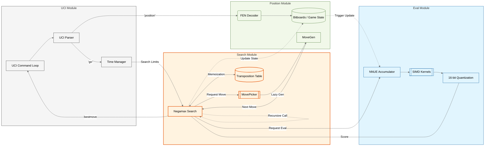
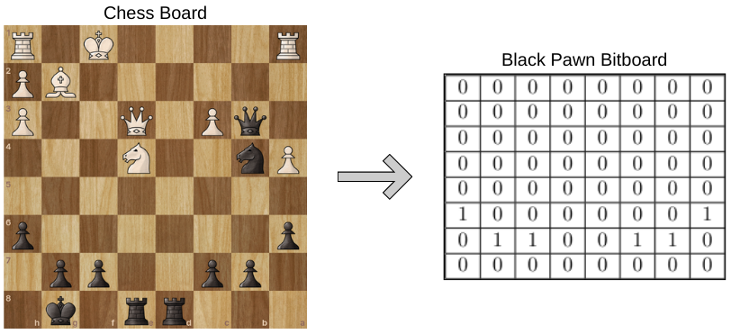

# [Minke](https://github.com/enfmarinho/Minke) | High-Performance Chess Engine

**Minke** is a high-performance C++ chess engine using **NNUE evaluation** and **SIMD-accelerated kernels**, ranked as the second strongest Brazilian engine on the Computer Chess Rating List (CCRL). It was designed as a testbed for exploring **memory-efficient data structures, performance engineering, and optimization techniques**. This case study focuses on **systems-level design, performance engineering, and data-driven validation**.

---

### Table of Contents
1. [Challenge](#1-challenge)
2. [Core Architecture Overview](#2-core-architectural-overview)
3. [Performance Engineering](#3-performance-engineering)
4. [Evaluation Engine: NNUE](#4-evaluation-engine-nnue)
5. [Experimentation Infrastructure & Validation](#5-experimentation-infrastructure--validation)
6. [Design Trade-offs & Philosophy](#6-design-trade-offs--philosophy)
7. [Reliability & Tooling](#7-reliability--tooling)

---

## 1 Challenge

Minke was built as a systems-focused chess engine under strict real-time and memory constraints, where evaluation latency, cache behavior, and search efficiency directly determine playing strength. The primary goal was to maximize effective search depth without sacrificing evaluation accuracy, using empirical validation rather than intuition to guide optimization decisions.

High-level outcomes (ranking, throughput gains) are documented in the project README and portfolio overview; this case study focuses exclusively on the architectural and performance engineering decisions that led to those results.

---

## 2 Core Architectural Overview


The engine follows a tightly coupled search–evaluation loop, illustrated in the architecture diagram above.

* **State Representation**: Game state is represented using bitboards, enabling cache-friendly move generation and constant-time make/unmake operations with minimal per-node overhead.

* **Search Loop**: performs a Negamax search with alpha-beta pruning. Under realistic branching factors, evaluation is invoked millions of times, making evaluation latency the dominant contributor to overall throughput.

* **Evaluation Model**: Position evaluation uses an Efficiently Updatable Neural Network (NNUE), where only neurons affected by a move are incrementally updated. Despite this optimization, NNUE inference remains the primary per-node cost.

* **Hardware-Level Optimization**: To mitigate this bottleneck, NNUE inference is implemented using SIMD, 16-bit quantized kernels, maximizing instruction-level parallelism and cache efficiency.

---

## 3 Performance Engineering
**TL;DR**
* Doubled evaluation throughput via SIMD-accelerated NNUE inference
* Minimized memory stalls using cache-efficient bitboards
* Increased playing strength through **data-driven, SPRT-validated** search heuristics

Performance in Minke is the result of deliberate optimization across compute, memory, and algorithmic efficiency. Each optimization was introduced with a clear performance goal and validated empirically.

### 3.1 SIMD-Accelerated NNUE Inference

**Problem**: NNUE dramatically improves evaluation accuracy but is computationally expensive. Without optimization, the inference engine becomes a compute-bound bottleneck, drastically reducing search depth and tactical strength.

**Solution**: To maximize evaluation throughput, Minke treats the neural network as a high-performance linear algebra problem:

* **Int16 Quantization**: The network uses 16-bit fixed-point arithmetic, allowing for a 2x increase in data density over 32-bit floats and enabling more efficient vectorization.

* **SIMD Intrinsics**: Core dot-product kernels are implemented using AVX2, AVX512 and NEON intrinsics. This allows the CPU to process 16 or 32 weights in a single clock cycle.

* **Incremental Accumulators**: Instead of a full forward pass, Minke utilizes an incremental update scheme. Only the "dirty" features (moved pieces) are processed, avoiding unnecessary re-computation.

This allows the CPU to pack multiple weights and activations into a single register and execute several operations per instruction using modern vector units.

View SIMD Implementation Detail (AVX2 Horizontal Reduction)
```C++
using vepi32 = __m256i;
inline int32_t vepi32_reduce_add(const vepi32 vec) {
    // Split 256-bit register into two 128-bit halves and add them
    __m128i low = _mm256_castsi256_si128(vec);
    __m128i high = _mm256_extracti128_si256(vec, 1);
    __m128i sum128 = _mm_add_epi32(low, high);

    // Horizontal reduction: sum all elements into the low 32 bits using shuffles
    __m128i tmp = _mm_add_epi32(sum128, _mm_shuffle_epi32(sum128, _MM_SHUFFLE(2, 3, 0, 1)));
    tmp = _mm_add_epi32(tmp, _mm_shuffle_epi32(tmp, _MM_SHUFFLE(1, 0, 3, 2)));

    return _mm_cvtsi128_si32(tmp);
}
```

> Note: This reduction is a critical-path operation in the NNUE dot-product, optimized to minimize cross-lane latency.

**Result:** 
* ~105% increase in Nodes Per Second (NPS) compared to the baseline evaluation. 
* High accuracy evaluation without hurtfully sacrificing search throughput.

#### Search Throughput vs Instruction Set (x86-64)
| SIMD             | Nodes/sec   | Speedup      | 
|:----------------:|:-----------:|:------------:|
| None             | 1502485     | -            | 
| AVX2             | 3082145     | ~105%        | 
| BMI2             | 3119613     | ~107%        | 
> Single-threaded search, fixed depth, identical position set. Tested on an intel i5-12400f.

### 3.2 Memory Locality & Bitboards

**Problem:** During search, performance is often limited by memory latency, not arithmetic throughput. Frequent "cache misses" during state updates can stall the CPU for hundreds of cycles.

**Solution:** Minke is designed around cache-friendly data structures:
* **Bitboard Representation**: Uses 64-bit integers (uint64_t) to represent piece placements. This allows board-wide calculations (like finding all possible pawn pushes) to execute in single-digit CPU instructions via bitwise parallelism.

<div align="center">
  
</div>

> Visualizing the State: By treating a uint64_t as an 8×8 grid, we perform symmetric multiprocessing on a single register. For example, a single bitwise AND between a sliding piece bitboard and an occupancy bitboard calculates all possible blockages simultaneously, eliminating the need for expensive loops or nested arrays.
* **Instruction-Level Optimization**: Leverages BMI2 instructions (e.g., PEXT) to implement Magic Bitboards. This transforms move generation from complex branching logic into a constant-time table lookup.
* **Cache-Aligned Transposition Table**: Entries are strictly sized to 32 bytes. This ensures exactly two entries fit within a standard 64-byte CPU cache line, eliminating "split-line" fetches and significantly reducing L1/L2 cache pressure during heavy search workloads, reducing caches misses.

**Result:** 
* ~27% speedup in search throughput by minimizing memory stalls and branch mispredictions.
* Higher IPC (Instructions Per Cycle): Optimized spatial locality keeps the "hot path" of the search resident in high-speed cache.

### 3.3 Search Optimizations & Heuristic Pruning (SPRT-Validated)

**Problem:** Even with fast evaluation and memory access, naïve search explores too many low-value branches, making heuristic decisions a key target for **data-driven optimization**.

**Solution:** The Negamax search is augmented with a collection of optimizations and heuristics designed to reduce the effective branching factor, turning search into a probabilistic optimization problem:
* **Pruning & Reductions**: Implemented Null Move Pruning (NMP) and Late Move Reductions (LMR) to skip unpromising branches based on depth and move history.
* **Move Ordering**: Utilized Killer Heuristics and History Tables to ensure the most "forcing" moves are searched first, maximizing Alpha-Beta cutoffs.
* **Data-Driven Validation (SPRT)**: Every change was validated via Sequential Probability Ratio Testing (SPRT). This statistically rigorous method ensures that a code change provides a genuine ELO gain before being merged.

Each heuristic was introduced as a controlled experiment, evaluated **in isolation**, and either accepted or rejected based on statistically significant results. 

**Result:** Consistent, measurable ELO gains from individual heuristics, with stable improvements validated through confidence intervals and protection against performance regressions.

> **Note:** Since these optimizations primarily affect pruning behavior rather than raw throughput, **Nodes Per Second (NPS) is not a meaningful metric**. Playing strength was measured exclusively via **SPRT**, the standard and statistically rigorous methodology for chess engine evaluation.

## 4 Evaluation Engine: NNUE
This section describes the architectural properties of NNUE that directly influenced constrains and design.

NNUE is the dominant per-node cost in Minke’s search pipeline. Unlike classical evaluators, its inference path introduces a non-trivial latency that is incurred millions of times during search, making evaluation throughput a primary performance concern.

### 4.1 Architecture and Topology Overview
The network follows a (768 -> 1024)×2 -> 1 architecture:

* **Input Layer**: Represents the board features (Piece-Square mapping). 64 squares x 12 pieces = 768

* **Perspective Layer (1024 x 2)**: Two identical hidden layers that represent the board from the perspective of the side-to-move and the opponent. This allows the engine to maintain symmetry in evaluation for both players.

* **Activation**: Uses a Squared Clipped ReLU activation, which provides a smoother gradient than standard ReLU while remaining computationally cheap for integer-based SIMD units.

* **Output Layer**: Compresses the 2048 activated hidden neurons into a single scalar value representing the evaluation.

```mermaid
graph LR
    classDef default fill:#fff,stroke:#333,stroke-width:1px,color:#000;
    classDef transformer fill:#e1f5fe,stroke:#01579b,stroke-width:2px,color:#000;
    classDef hidden fill:#fff3e0,stroke:#e65100,stroke-width:2px,color:#000;
    classDef head fill:#dcedc8,stroke:#33691e,stroke-width:2px,color:#000;
    classDef STM fill:#fce4ec,stroke:#880e4f,stroke-width:2px,color:#000;

    subgraph Input ["Input Layer"]
        F1[Piece-Square Features: 768]
    end

    subgraph FT ["Feature Transformer"]
        direction LR
        W_Acc[White Perspective: 1024]
        B_Acc[Black Perspective: 1024]
    end

    STM_Logic{Side to Move?}

    subgraph Hidden ["Perspective Layer"]
        direction TB
        Concat[Concat Feature Transformers: Us + Them]
        ACT[SCRELU Activation]
    end

    subgraph Head ["Output Head"]
        L3[Linear Layer: 1 Neuron]
        Final([Evaluation Score])
    end

    F1 -->|Incremental Update| W_Acc
    F1 -->|Incremental Update| B_Acc
    
    W_Acc -.-> STM_Logic
    B_Acc -.-> STM_Logic
    
    STM_Logic -->|White to Move| Concat
    STM_Logic -->|Black to Move| Concat
    
    Concat --> ACT
    ACT --> L3
    L3 --> Final

    class W_Acc,B_Acc FT;
    class Concat,ACT Hidden;
    class L3,Final Head;
    class STM_Logic STM;
```




### 4.2 The Accumulator: O(1) Incremental Updates

The core design decision behind NNUE is the use of incremental accumulators. Instead of recomputing the network from scratch after each move, Minke maintains per-side accumulator vectors representing the sum of active feature contributions. When a move is made:

* Only the features affected by that move are updated
* The accumulator is adjusted via vector addition/subtraction
* The remaining network layers operate on the updated accumulator

* **Design trade-off**:
* **Pro**: Dramatically reduces redundant computation and stabilizes evaluation cost
* **Con**: Requires careful feature encoding and accumulator management

### 4.3 Quantization & Inference

To maximize SIMD throughput, the network is **quantized to 16-bit integers** (QA=255,QB=64). 

**Trade-off**: 
* Introduces rounding noise, reducing evaluation quality
* Enables 16-way parallelism on 256-bit registers, increasing search throughput

This reflects a broader design philosophy: evaluation consistency and throughput are more valuable than marginal representational precision.

## 5 Experimentation Infrastructure & Validation
**TL;DR**
* Built a custom Rust CLI to orchestrate NNUE training, evaluation, and model iteration
* Used distributed testing to validate performance and detect regressions at scale
* Treated training and validation as a data pipeline

While the chess engine itself is performance-critical, its strength ultimately depends on a reliable and repeatable training and validation pipeline to perform incremental improvements. For that, experimentation and validation is treated as a first-class engineering and data-driven system.

### 5.1 Training Orchestration

**Problem:** Training NNUE models involves multiple stages: data generation, filtering, training, validation, and comparison, which can easily become error-prone and slow when managed manually.

**Solution:** To address this, I built a custom Rust-based CLI that orchestrates the entire training lifecycle:
* Automated dataset preparation and preprocessing
* Invocation and monitoring of NNUE training runs using the Bullet ML framework
* Versioned tracking of trained networks and associated metadata
* Automated validation runs against reference engines and prior models

The CLI acts as a single control plane for experimentation, ensuring that training runs are reproducible and comparable. By codifying the workflow, iteration speed increased while reducing human error and configuration drift.

### 5.2 Distributed Testing & Regression Detection

**Problem:** Small performance regressions in a chess engine are difficult to detect and often only appear under large-scale testing. Manual validation does not scale.

**Solution:** Minke uses a distributed testing framework to evaluate engine changes across many games:
* Tests are distributed across multiple machines and cores
* Engine builds are evaluated against baselines under controlled conditions
* Results are aggregated and organized automatically

This system enables early detection of both playing strength regressions and performance anomalies, ensuring that improvements in one area do not silently degrade another.

Validation is tightly integrated with the development workflow, allowing changes to be accepted or rejected based on empirical evidence rather than intuition.

**Result:** 
* Early detection of regressions before integration
* Scalable validation aligned with data-driven development practices
* Increased confidence in engine stability across releases

**Why this matters:** By treating training and validation as data pipelines, Minke bridges low-level systems programming with large-scale experimentation. This approach mirrors production data-driven systems, where correctness, repeatability, and scalability are just as important as raw performance.

## 6 Design Trade-offs & Philosophy
**TL;DR**
* Balanced memory usage and performance by choosing a stateful Transposition Table
* Language choices reflect subsystem-specific constraints
* Engine strength is optimized holistically, balancing depth, heuristics, and evaluation cost, driven by statistical analysis (SPRT)

Minke’s architecture reflects a series of deliberate trade-offs evaluated under real performance constraints. Decisions were driven by empirical impact on throughput, memory locality, and search stability, in order to increase playing strength.

### 6.1 State vs. Statelessness (Transposition Table)

**Problem:** A naive search recalculates positions repeatedly, wasting computation. The Transposition Table (TT) can store previously evaluated positions, but introduces complexity:

**Design Choice**: Minke employs a stateful, shared TT optimized for cache locality and multi-threaded access.
* Reduces redundant evaluation and improves effective search speed
* Uses cache-aligned entries to reduce cache misses and reduce memory related bottlenecks
* Employs conservative replacement policies to preserve high-value nodes

**Trade-off**: While stateless designs simplify reasoning, they leave substantial performance on the table. The added complexity of a stateful TT was justified by measurable gains in node efficiency and move quality.

### 6.2 Language Choice

**Problem:** Different parts of the system have different requirements:

* Engine core: must maximize raw CPU throughput
* Training pipeline: must orchestrate experiments safely and correctly

**Design Choice:**
* C++ for the engine core: High-performance, fine-grained memory control, low-level SIMD support
* Rust for the training pipeline: Memory safety, concurrency guarantees, rapid experimentation and tooling
* Python is used sparingly for auxiliary tasks like data analysis

Rather than forcing a single-language solution, Minke treats language choice as an engineering parameter, selecting the best tool for each subsystem’s constraints.

### 6.3 Search Depth vs. Evaluation Accuracy

**Problem**: NNUE evaluation significantly increases per-node cost. Deeper search improves tactical resolution, while stronger evaluation reduces positional error at each node.

**Design Choice**: Minke optimizes this balance by aggressively reducing NNUE inference latency with SIMD kernels, quantization and accumulators. This aims to preserve depth without sacrificing evaluation quality.

This approach treats evaluation speed as a first-class search parameter, allowing deeper exploration without regressing positional accuracy.

### 6.4 Philosophy Summary

Minke reflects a systems-oriented engineering mindset:

* **Performance-aware**: Memory layout, SIMD usage, and cache behavior are explicitly considered and guided by data analysis to guide development and systems decisions
* **Empirically validated**: Heuristics and architectural decisions are accepted only after large-scale testing
* **Pragmatic tooling**: Languages and abstractions are chosen per constraint
* **Trade-off driven**: Strength emerges from balanced systems, not isolated optimizations

## 7 Reliability & Tooling
**TL;DR**
* Validated engine correctness with deterministic benchmarks
* Ensured performance stability via automated regression tests and CI pipelines

Minke is designed not just for speed, but for reproducibility and reliability. Deterministic testing allows for strong guarantees that optimizations never break correctness, even in a high-performance, multi-threaded environment.

### 7.1 Deterministic Benchmarking & Correctness

**Problem:** High-speed search engines are prone to subtle bugs in move generation, evaluation, or search logic. Traditional unit tests are not always meaningful because correctness depends on the full interaction of engine modules.

**Solution:** Minke uses benchmarks based on deterministic reference positions:
* A set of test positions is chosen, each with a known, precomputed number of nodes that should be visited during search
* The engine runs on these positions, and the actual nodes searched are compared against the reference values
* Any deviation flags a regression, ensuring that search logic and heuristics remain correct

**Result:**
* Deterministic, reproducible validation of the engine’s search correctness
* Confidence that new optimizations preserve correct behavior
* Avoids subtle errors that could appear only after thousands of games

### 7.2 CI/CD & Regression Monitoring

**Problem:** Frequent optimizations can inadvertently reduce playing strength or alter search behavior. Manual validation does not scale.

**Solution:**
* Automated CI pipelines: Every commit runs the benchmark suite and validates node counts for all reference positions
* Regression detection: Deviations are logged and flagged, preventing integration of faulty commits

**Result:**
* Immediate feedback on regressions
* Maintains both engine correctness and performance stability

#### Why this matters

By relying on deterministic benchmarking and automated regression pipelines, Minke demonstrates engineering rigor without relying on conventional unit tests. This methodology ensures that high-speed optimizations never compromise correctness, perfectly aligning with systems-focused, high-performance development practices. This approach mirrors invariant-based testing techniques commonly used in high-performance databases, systems, and compilers.

*End of Case Study*
